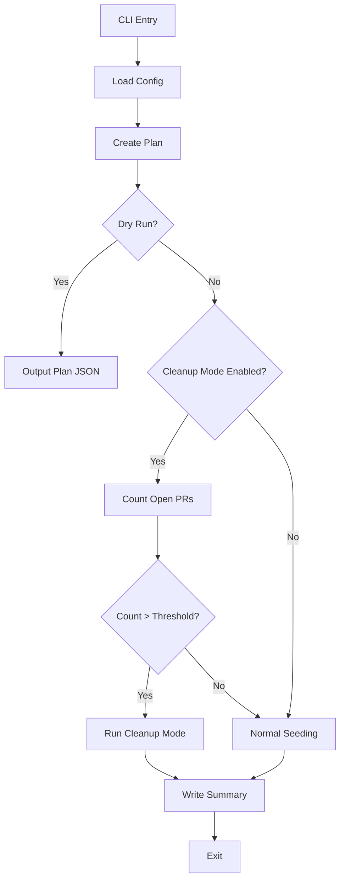
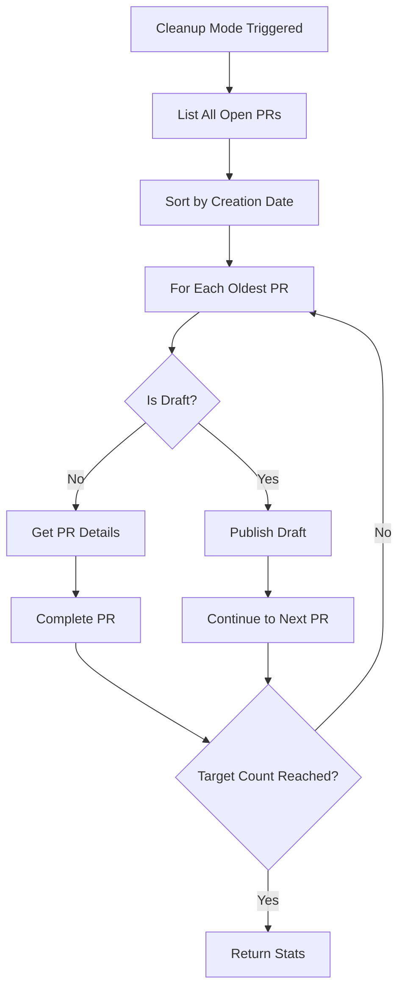
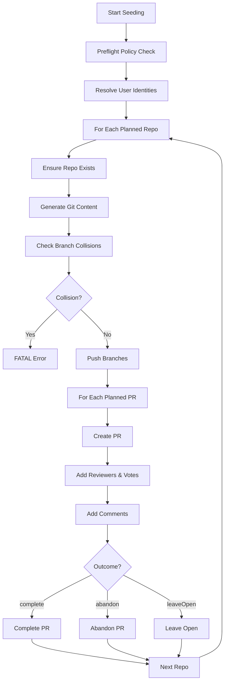
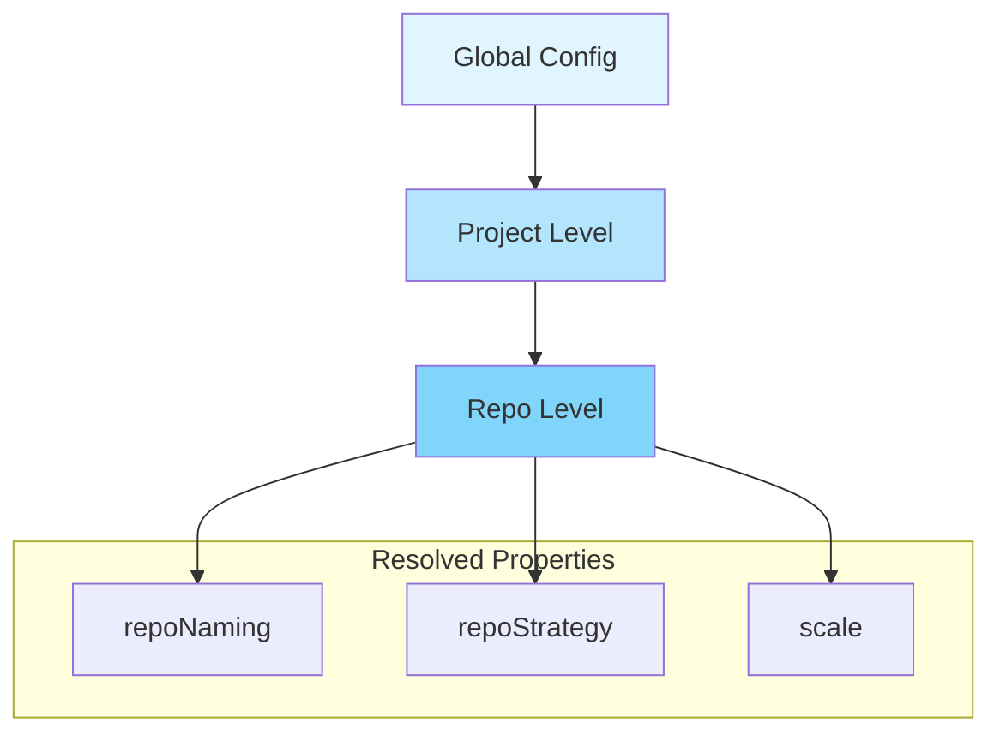
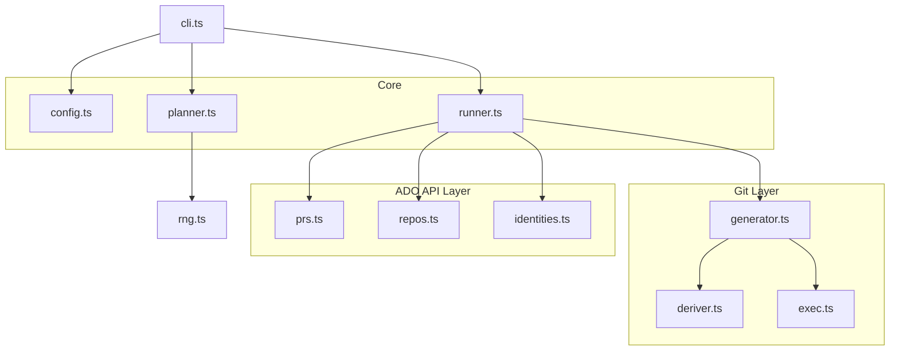
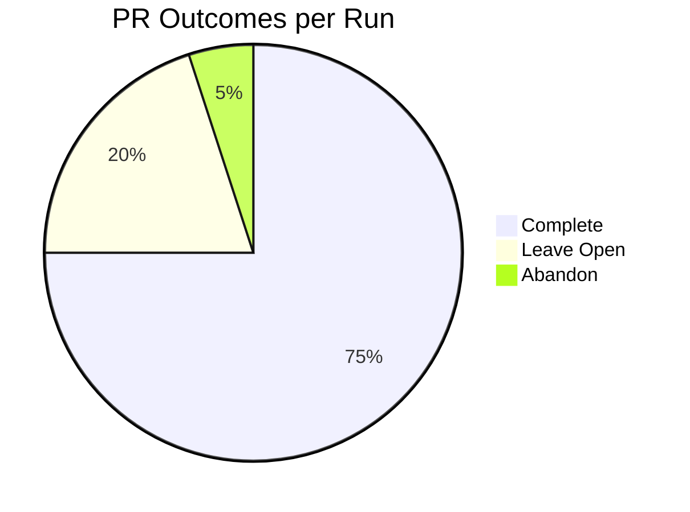
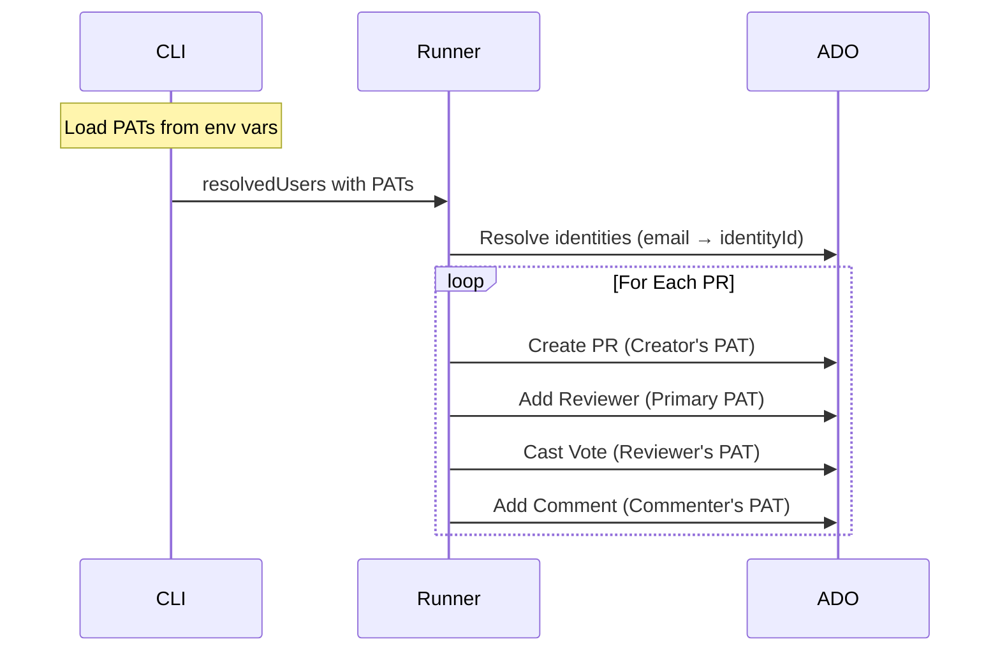
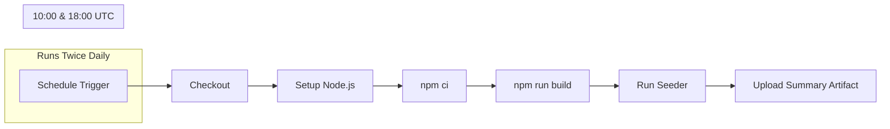

# ADO Git Repo Seeder - Architecture Diagrams

Visual documentation of the seeder's architecture and execution flow.

---

## High-Level Execution Flow

---

## Cleanup Mode Logic

---

## Normal Seeding Flow

---

## Configuration Hierarchy

---

## Module Dependencies

---

## PR Outcome Distribution

---

## Multi-User Attribution

---

## GitHub Actions Workflow

