# ADO Git Repo Seeder - Architecture Diagrams

Visual documentation of the seeder's architecture and execution flow.

---

## High-Level Execution Flow

---

## Module Dependencies

---

## Normal Seeding Flow

---

## Conflict Resolution Flow

---

## ASKPASS Authentication Pattern

---

## Cleanup Mode Logic

---

## Configuration Hierarchy

---

## Multi-User Attribution

```mermaid
sequenceDiagram
    participant CLI
    participant Runner
    participant ADO
    
    Note over CLI: Load PATs from env vars
    CLI->>Runner: resolvedUsers with PATs
    
    Runner->>ADO: Resolve identities (email → identityId)
    
    loop For Each PR
        Runner->>ADO: Create PR (Creator's PAT)
        Runner->>ADO: Add Reviewer (Primary PAT)
        Runner->>ADO: Cast Vote (Reviewer's PAT)
        Runner->>ADO: Add Comment (Commenter's PAT)
    end
```

---

## Summary Output Generation

---

## GitHub Actions Workflow

---

## PR Outcome Distribution

